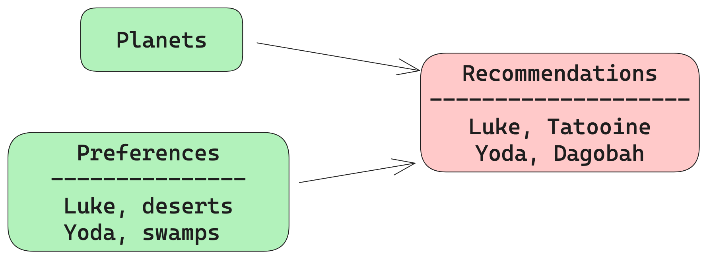

<!-- _class: lead -->

# TDD for Data Engineering

Guillaume (**G**) Belrose

--- 
<!-- header:  -->

 

--- 

 

<!-- _footer: Make your own: https://imgflip.com/memegenerator/19005569/Darth-Vader -->

---

<!-- paginate: true -->
<!-- footer: TDD for Data Engineering -->

# Agenda

- Some context on Data Engineering
- EL**T** Data Pipelines
- Data Pipelines with TDD
- Experiences from production

---

# What: Data Pipelines

 

---

# How: ~~Software~~ Data Engineering principles

- **TDD** / unit testing
- Automation
- CI/CD
- Telemetry
- Operability
- Iterative and incremental approaches

---

# Test Driven Development

* Write the test first :red_circle:
* Write the code to pass the test :green_circle:
* Keep on refactoring the logic (cleaner, more expressive)
* Dave Farley's [TDD Is The Best Design Technique](https://www.youtube.com/watch?v=ln4WnxX-wrw)

---

# EL**T** Data Pipelines

 

---

# dbt (Data Build Tool)

- Open-source CLI tool to build, test and maintain data pipelines
- Transform data in the warehouse via **SELECT** statements
- Suitable for anyone with **SQL** skills
- Easy to learn [fundamentals](https://courses.getdbt.com/courses/fundamentals) 
- Built-in support **data quality checks**

---

# Some concepts

- Jinja2 SQL templating engine
- **Models** and **references**
- Macros

---

# A Star Wars Data Pipeline

 

<!-- _footer: TDD for Data Engineering | Star Wars dataset: https://www.kaggle.com/datasets/jsphyg/star-wars -->

---

# dbt-unit-testing

- https://github.com/EqualExperts/dbt-unit-testing
- Extend dbt test with unit testing capability
- `Adopt` on the Thoughtworks [radar](https://www.thoughtworks.com/radar/tools/dbt)

---

# A Star Wars Data Pipeline with TDD 

 

---
# Experiences from production

 

---
# Data Ingestion Pipeline

* Suppliers file formats (deeply nested JSON, fixed length format)
* Parsing logic in SQL (text manipulation, regex, JSON unmarshalling in Snowflake)
* Mock **incoming data** to validate logic

---
# Data Export Pipeline

* Data contract agreed with 3rd party consumer
* Format mapping (dates, flags, phone numbers)
* Non trivial business logic to **produce** the data
* Mock the **in warehouse data** to validate logic

---
# Data Compliance Pipeline

* Respect of GDPR rules
* Data to be erased or anonymised
* Complicated business logic to identify suitable records (e.g. claims)
* Complicated logic to anonymise data (back to the raw layer)

---

# Findings

* For anything non trivial !!!
* TDD **guides** design (CTE vs subquery, testable features)
* Tests make you comfortable to **refactor** code
* Much faster **feedback loop** (compared with integration tests)
* **Documentation** as a side effect

---

# Findings: production issues
- Write a test case to replicate the problem
- Implement the fix 

---

# What if I don't use DBT?

- ELT pipelines: [SQLMesh](https://sqlmesh.com/), Google [dataform](https://cloud.google.com/dataform?hl=en)
- TDD is a **practice**, try to apply it with your stack
- Supported in many languages (Python, Scala)
- Supported in many frameworks (Spark)

---

# The data quality arsenal

> Organizations need good quality data for decision-making and insights
* TDD is one part of the puzzle :jigsaw: 
* Integration tests
* Data Quality Checks
* Alerting & Monitoring

--- 

<!-- _class: lead -->

# Thank you!
