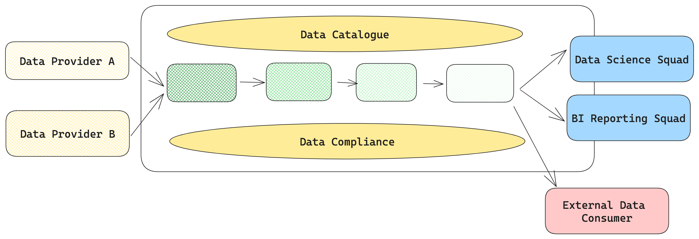
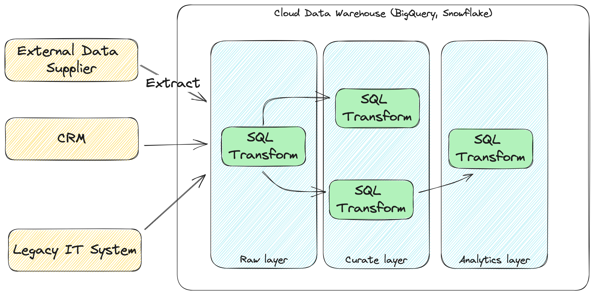
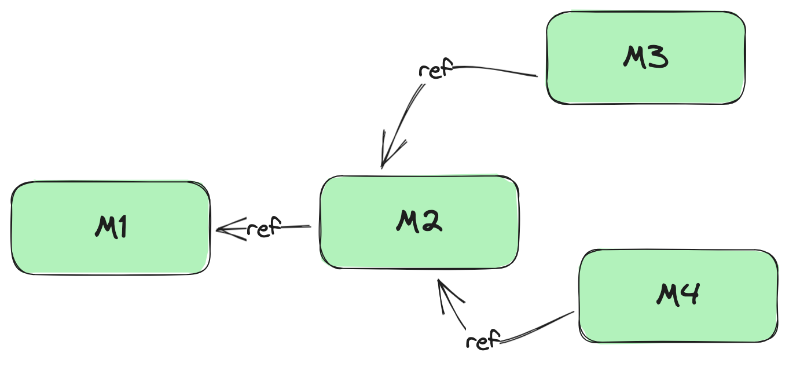
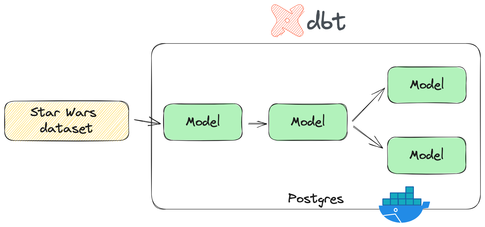
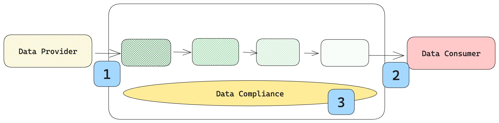

<style>
blockquote {
  background: #ffedcc;
  border-left: 20px solid #d1bf9d;
  margin: 1.5em 10px;
  padding: 0.5em 10px;
}
</style>

<!-- _class: lead -->


# TDD for Data Engineering

Guillaume (**G**) Belrose

--- 
<!-- header:  -->

 

--- 

 

---

<!-- paginate: true -->
<!-- footer: TDD for Data Engineering -->

# Agenda

- About Data Engineering
- About TDD
- EL**T** Data Pipelines
- DBT and DBT unit testing
- Experiences from production
- Wrap-up

---

# What: Data Engineers duties

 

---

# How: Data Engineering principles

> A software engineering specialism which takes the **best practices from** _traditional_ **software engineering** (building applications and systems) - but focuses these practices on the **data domain**.
— Thorben Louw

---

 

---

<!-- _class: lead -->

# TDD in the context of Data Pipelines

---

# Test Driven Development

* Write the test first :red_circle:
* Pass the test :green_circle:
* Refactor the code (cleaner, more expressive)
* Dave Farley's [TDD Is The Best Design Technique](https://www.youtube.com/watch?v=ln4WnxX-wrw)
* !! More about **design** than testing !!

---

# EL**T** Data Pipelines

 

---

# dbt (Data Build Tool)

- Open-source CLI tool to build, test and maintain data pipelines
- Transform data in the warehouse via **SELECT** statements
- Built-in support for documentation, data lineage and quality tests
- Suitable for anyone with SQL skills
- Easy to learn [fundamentals](https://courses.getdbt.com/courses/fundamentals) 

---



# Some concepts

- SQL template engine with Jinja2
- Model references
- Macros

---

# A Data Pipeline, in a galaxy far far away

 

--- 

<!-- _class: lead -->

# Demo

---

<!-- _class: lead -->

# SQλ

---

# dbt-unit-testing

- https://github.com/EqualExperts/dbt-unit-testing
- From Equal Experts :love_letter:
- `Adopt` on the TW radar https://www.thoughtworks.com/radar/tools/dbt

---

# A Star Wars Travel Agency

- Given a customer's holiday preference(s)
- Recommend Star Wars planets to visit

```csv
customer_name,vacation_type
Darth Vader,volcanoes
```
:point_down:
```csv
customer_name,recommended_planet
Darth Vader,Mustafar
```
---

<!-- _class: lead -->

# Demo

---
# Use in production

 

---

# Findings

* Tests **guide** design
* Tests make you comfortable to **refactor** code
* Tests **document** what the intent is
* Early **feedback** (vs integration testing)

---

# Findings: production issues
- Write a test case to replicate the problem
- Implement the fix 

---

# What if I don't use DBT?

- SQL Mesh, Google dataform
- TDD is a **practice**, try to apply it with your stack
- Supported in many languages (Python, Scala)
- Supported in many frameworks (Spark)

---

# The data quality arsenal
* Integration tests
* Data Quality Checks
* Alerting & Monitoring

--- 

# To conclude

> The hardest part of having good metrics is having good data
— Toby Mao, Data Engineering [Podcast](https://www.dataengineeringpodcast.com/sqlmesh-open-source-dataops-episode-380)

--- 

<!-- _class: lead -->

# Thank you!

